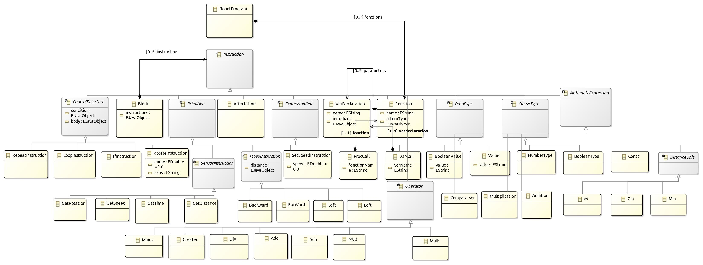

# Description

Ce projet vise à développer un DSL (Domain-Specific Language) dédié à la manipulation et au contrôle d'un robot. L'objectif principal est de créer un langage personnalisé à partir d'un métamodèle Ecore afin de générer du code Arduino à téléverser sur le robot après compilation. Dans le cadre de ce TP, nous avons créé un interpréteur qui simule le robot sur une page web.

## lancement du projet

Pour lancer le projet, vous devez suivre les étapes suivantes :
1. Cloner le projet à partir de GitHub
2. Installer les dépendances nécessaires en exécutant la commande `npm install`

## Compilateur

Pour lancer l'interpreteur suivre les étapes suivantes:

1. Créez un fichier .robot contenant un programme écrit en langage Robot-dsl. Pour tester le  compilateur, vous pouvez utiliser les programmes d'exemple disponibles dans le dossier ./
exemples/ du projet.

2. Construire le projet avec `bash ./compiler-luncher.sh` qui contient les commandes:
    - `npm run langium:generate`
    - `npm run build`
    - `node ./bin/cli compile ./exemples/test.robot | tail -n +37 > ./outputResult/test.ino`
3. Tester le compilateur avec l’IDE Arduino
    - Ouvrez l'IDE Arduino et ajoutez les bibliothèques requises pour le bon fonctionnement du robot. Ces bibliothèques sont disponibles dans le dossier ./src/language/semantics/compiler/lib/.
    - Dans l'IDE Arduino : allez dans "Croquis" -> "Inclure une bibliothèque" -> "Ajouter une bibliothèque .ZIP...".
    - Copier le code compilé :
      Collez le résultat de la commande de compilation dans l'IDE Arduino.
    - Vérifier le code :
      Cliquez sur le bouton "Vérifier" dans l'IDE Arduino pour vérifier que le code généré par le compilateur est valide.
    - Téléverser sur le robot :
      Si le robot est connecté à l'IDE Arduino, cliquez sur "Téléverser" pour exécuter le programme sur le robot.

## Interpreteur

Pour lancer l'interpréteur, suivez les étapes suivantes :

1. Construire le projet avec `bash ./interpreter-luncher.sh` qui contient les commandes:
    - `npm run langium:generate`
    - `npm run build`
    - `npm run build:web`
    - `npm run serve`
2. Accéder à l'application :

Une fois le serveur lancé, ouvrez votre navigateur et rendez-vous à l'URL suivante :
http://localhost:3000
Vous pourrez valider, exécuter et simuler votre code écrit en Robot-DSL (.robot).

3. Tester l'interpréteur :

Pour tester l'interpréteur, vous pouvez utiliser les programmes d'exemple disponibles dans le dossier ./examples/ du projet.

4. Exemple de simulation

<video controls style="max-width: 900px; width: 100%;">
  <source src="./assets/robotDslSimulation.webm" type="video/webm">
  Votre navigateur ne supporte pas les vidéos au format webm.
</video>

## Metatmodel

